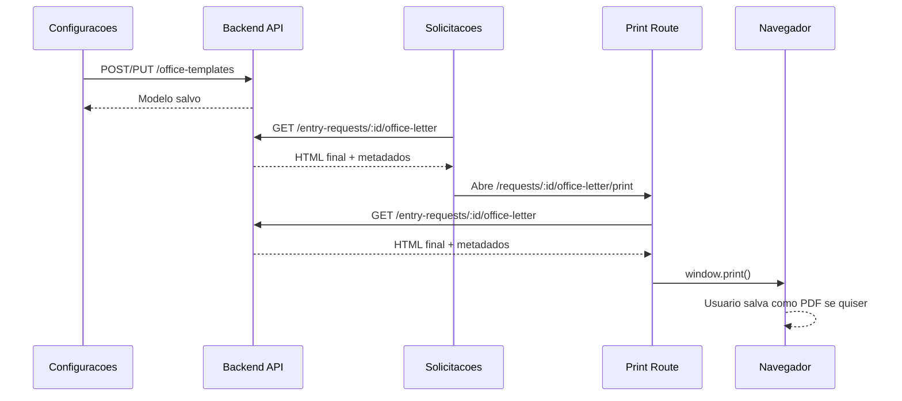

# Oficios Frontend A4 Export Design

## Goal

Substituir a exportacao atual de PDF de oficios no backend por uma renderizacao
frontend fiel ao modelo configurado, usando uma tela A4 no navegador para que o
usuario visualize o documento e salve/baixe como PDF pelo proprio navegador.

## Current State

Os modelos de oficio ja existem nas configuracoes e sao salvos pelo backend em
`OfficeLetterTemplate`. A tela de solicitacoes carrega o oficio por
`GET /entry-requests/:id/office-letter` e hoje baixa o arquivo chamando
`GET /entry-requests/:id/office-letter/pdf`.

O endpoint de PDF usa `pdfmake` e `html-to-pdfmake` no backend. Essa conversao
nao preserva integralmente o HTML/CSS do modelo, limita posicionamento livre e
cria uma segunda representacao do documento. A nova solucao deve remover essa
conversao para oficios.

## Decisions

- O backend nao gera PDF de oficio.
- O backend continua sendo a fonte de dados, numeracao, validacao de variaveis
  e HTML final renderizado com os dados da solicitacao.
- O frontend renderiza o documento inteiro em uma pagina A4 real.
- O botao de exportacao abre uma rota/tela frontend em nova aba.
- A tela frontend exibe o documento e oferece acao de imprimir/salvar PDF.
- O usuario baixa o PDF usando o fluxo nativo do navegador.
- A previa do modelo nas configuracoes deve usar o mesmo padrao visual A4 usado
  na tela de exportacao.

## Non-Goals

- Nao alterar os relatorios gerais, notas fiscais, movimentacoes, licencas ou
  cobrancas que ainda usam PDF no backend.
- Nao adicionar geracao automatica de PDF com `html2canvas`, `jsPDF` ou
  biblioteca equivalente.
- Nao remover o cadastro de modelos de oficio nem a validacao de variaveis no
  backend.
- Nao criar um editor WYSIWYG completo com arrastar/soltar nesta entrega.

## User Flow

1. Admin configura o modelo em `Configuracoes > Oficios`.
2. A previa do editor mostra o documento dentro de uma pagina A4.
3. Usuario abre uma solicitacao de entrada nao geral.
4. Usuario clica em `Ver oficio`.
5. O modal mostra a previa do oficio com o mesmo HTML retornado pelo backend.
6. Usuario clica em `Abrir PDF`.
7. O frontend abre nova aba em `/requests/:id/office-letter/print`.
8. A nova aba busca `GET /entry-requests/:id/office-letter`.
9. A tela renderiza a pagina A4 com barra de acoes.
10. Usuario clica em `Imprimir / Salvar PDF` ou usa o atalho do navegador.
11. No dialogo nativo do navegador, o usuario escolhe salvar como PDF se quiser.

## Architecture

### Backend

Keep:

- `GET /entry-requests/:id/office-letter`
- `getEntryRequestOfficeLetter`
- `OfficeLetterTemplate` CRUD
- validacao de variaveis de oficio
- numeracao `officeNumber` / `officeYear`
- montagem do HTML final do oficio

Remove for office letters only:

- `GET /entry-requests/:id/office-letter/pdf`
- `buildEntryRequestOfficeLetterPdf`
- `renderOfficePdfWithPdfmake`
- normalizacao de HTML especifica para `pdfmake`
- politicas de URL/imagem especificas da conversao de PDF de oficio
- testes que validam download do endpoint `/office-letter/pdf`
- mencao no README de que oficios sao exportados pelo backend com `pdfmake` e
  `html-to-pdfmake`

Dependencies should only be removed from `apps/backend/package.json` when they
are no longer used elsewhere in the backend. `pdfkit` remains because other
report flows still depend on it.

### Frontend

Create a small office-document rendering boundary:

- `OfficeLetterPage` or equivalent component responsible for A4 document chrome.
- `OfficeLetterPrintPage` route responsible for loading the document by id.
- Shared CSS/classes for screen preview and print output.

The print route must:

- load the current office letter from `/entry-requests/:id/office-letter`;
- render `letter.documentHtml` inside an A4 viewport;
- include actions outside the printable area;
- hide actions in `@media print`;
- call `window.print()` only from explicit user action, not automatically on
  page load.

The requests page must:

- stop using `apiFile` for office-letter PDFs;
- replace `Exportar PDF` behavior with opening the frontend print route;
- preserve the existing `Ver oficio` modal behavior;
- keep the local width change in `requests-page.tsx` unless implementation
  requires a direct conflict.

### CSS

Use browser print CSS:

```css
@page {
  size: A4;
  margin: 0;
}

@media print {
  body {
    background: #fff;
  }

  .office-letter-print-actions {
    display: none;
  }

  .office-letter-page {
    box-shadow: none;
    margin: 0;
  }
}
```

The printable document root should use:

- `width: 210mm`
- `min-height: 297mm`
- white background
- dark text
- page-aware overflow rules
- no app shell navigation in the print route

Existing template HTML may already contain
`data-office-letter-document="true"`. The frontend renderer should respect that
root instead of wrapping a second page around it.

## Data Flow



## Error Handling

- Se a solicitacao nao existir, a tela de impressao mostra o erro retornado pela
  API.
- Se o usuario nao tiver acesso ao almoxarifado, o backend segue retornando erro
  de permissao.
- Se nao houver modelo ativo, o backend continua usando o modelo padrao.
- Se o navegador bloquear nova aba, o modal deve manter o erro/feedback em tela.
- Se a imagem do modelo nao carregar, o documento ainda deve renderizar o
  restante do conteudo.

## Testing

Backend:

- Atualizar/remover testes que esperam `GET /entry-requests/:id/office-letter/pdf`.
- Manter testes para `GET /entry-requests/:id/office-letter`.
- Manter testes de CRUD de modelos e validacao de variaveis.
- Rodar build do backend para garantir remocao limpa dos imports de PDF de
  oficio.

Frontend:

- Atualizar teste de `RequestsPage` para validar que `Abrir PDF` abre a rota
  frontend de impressao, sem chamar `/office-letter/pdf`.
- Testar a tela de impressao carregando o oficio e renderizando o HTML do
  documento.
- Testar que o botao `Imprimir / Salvar PDF` chama `window.print`.
- Atualizar teste de `SettingsPage` para garantir previa A4 do modelo.

Verification:

- `pnpm --filter @almoxarifado/backend test`
- `pnpm --filter @almoxarifado/backend build`
- `pnpm --filter @almoxarifado/frontend test`
- `pnpm --filter @almoxarifado/frontend build`
- `git diff --check`

## Acceptance Criteria

- Nao existe mais endpoint backend de PDF para oficio.
- Clicar no botao de PDF do oficio abre uma rota frontend em nova aba.
- A rota frontend renderiza o documento A4 com o HTML do modelo.
- O usuario consegue salvar como PDF pelo navegador.
- A previa de configuracao de oficios usa o mesmo enquadramento A4.
- O backend nao importa `pdfmake`/`html-to-pdfmake` para oficios.
- Testes e builds relevantes passam, ou qualquer falha preexistente fica
  isolada e relatada.

